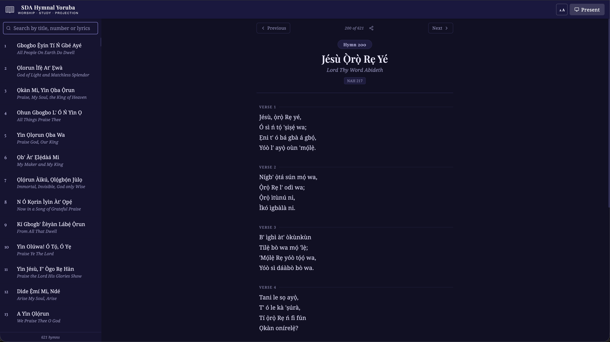
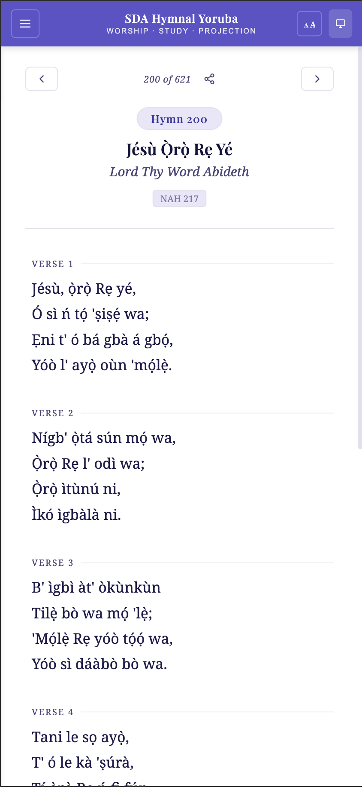
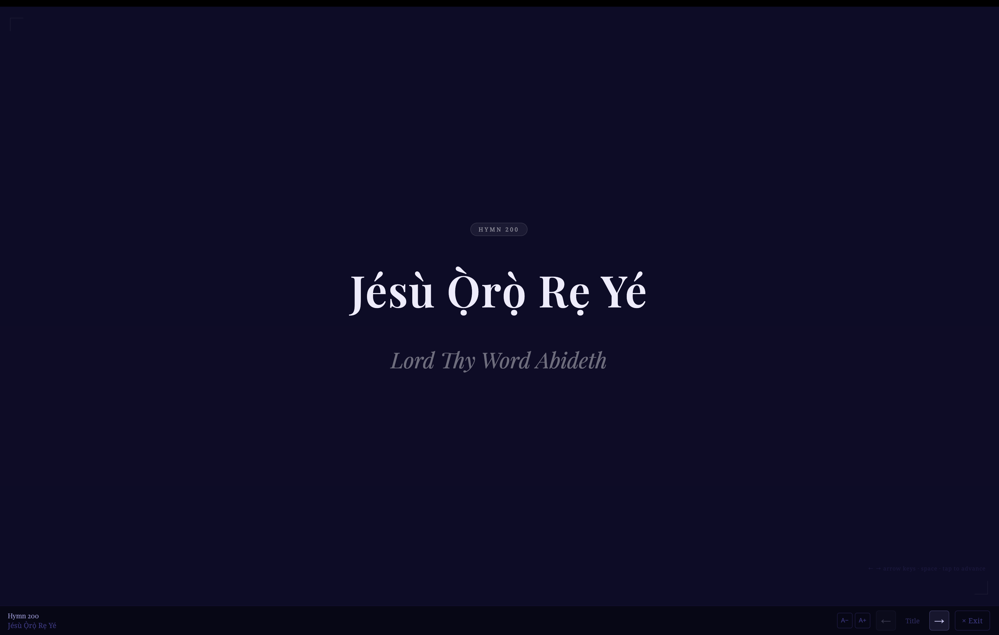

<p align="center">
  
</p>

# SDA Hymnal Yoruba

A web-based Yoruba hymnal for Seventh-day Adventist worship, study, and church projection. Browse, search, and present over 620 hymns.

**Live site:** [sdahymnalyoruba.com](https://sdahymnalyoruba.com)

## Screenshots

<table align="center">
  <tr>
    <td align="center"><strong>Desktop</strong></td>
    <td align="center"><strong>Mobile</strong></td>
  </tr>
  <tr>
    <td></td>
    <td align="center"></td>
  </tr>
  <tr>
    <td align="center" colspan="2"><strong>Presentation Mode</strong></td>
  </tr>
  <tr>
    <td align="center" colspan="2"></td>
  </tr>
</table>

## Features

- Full-text search by title, number, or lyrics (with diacritics-insensitive matching)
- Presentation mode for church projection with keyboard, touch, and swipe controls
- Adjustable font sizes for reading and presentation
- Dark mode (auto-detects system preference or manual toggle)
- Offline support via service worker
- PWA - installable on mobile devices
- Responsive design for desktop, tablet, and mobile
- Print-friendly hymn layout
- Deep linking to individual hymns via `?hymn=` URL parameter

## Tech Stack

No frameworks, no dependencies. Uses [esbuild](https://esbuild.github.io/) for minification only.

- `index.html` - markup
- `styles.css` - all styles
- `app.js` - all application logic
- `hymns.json` - hymn data (titles, lyrics, cross-references)
- `sw.js` - service worker for offline caching
- `manifest.json` - PWA manifest
- `sitemap.xml` - sitemap for search engines
- `build.js` - build script (minifies JS, CSS, JSON into `dist/`)

## Running Locally

```bash
npm install
npm run dev
```

Then open [http://localhost:8787](http://localhost:8787). The dev server watches for file changes and auto-rebuilds.

## Contributing

Contributions are welcome - especially hymn corrections, missing diacritics, and translations. See [CONTRIBUTING.md](CONTRIBUTING.md) for the full guide.

### Hymn Data

All hymns live in `hymns.json`. Each hymn has this structure:

```json
{
  "index": "001",
  "number": 1,
  "title": "Gbogbo Ẹ̀yin Tí Ń Gbé Ayé",
  "english_title": "All People On Earth Do Dwell",
  "references": {
    "SDAH": 16,
    "NAH": 2,
    "CH": 14
  },
  "lyrics": [
    {
      "type": "verse",
      "index": 1,
      "lines": [
        "Gbogbo ẹ̀yin tí ń gbé ayé",
        "Ẹ f' ayọ̀ kọrin s' Oluwa,"
      ]
    },
    {
      "type": "chorus",
      "index": 1,
      "lines": [
        "Chorus line one",
        "Chorus line two"
      ]
    }
  ],
  "revision": 3
}
```

### How to Contribute

1. **Fork** the repository
2. **Create a branch** for your change (`git checkout -b fix/hymn-42-typo`)
3. **Make your changes** - edit `hymns.json` for hymn corrections, or the relevant file for code changes
4. **Test locally** with `npm run dev`
5. **Submit a pull request** with a clear description of what you changed and why

### What We Need Help With

- **Hymn corrections** - fixing typos, missing or incorrect diacritics (ẹ, ọ, ṣ, tonal marks)
- **Missing hymns** - adding hymns that are not yet in the collection
- **Cross-references** - adding SDAH, NAH, or CH numbers where missing
- **Accessibility** - improving screen reader support, keyboard navigation
- **Bug reports** - open an issue if something doesn't work

### Guidelines

- Preserve Yoruba diacritics accurately - they change meaning
- Bump the `revision` field when editing an existing hymn
- Keep the JSON valid - test with `node -e "require('./hymns.json')"` before committing
- One hymn fix per pull request makes review easier

## Multi-Platform Architecture

`hymns.json` is the single source of truth for all hymn data. It powers the web app directly and will also serve the native mobile apps (iOS and Android).

### How It Works

`hymns.json` is publicly accessible at:

```
https://sdahymnalyoruba.com/hymns.json
```

The native apps will consume this URL as a lightweight API:

- **iOS** (Swift) and **Android** (Kotlin) apps ship with a bundled copy of `hymns.json` for offline use and first launch
- On app launch, each app checks the remote URL for an updated version
- If newer data is available, it downloads and caches the updated `hymns.json` locally
- This means hymn corrections and additions reach all platforms with a single `git push` - no app store update required

### Why This Approach

- **Zero backend** - no server to maintain, no API to build, no database to manage
- **Single update path** - fix a typo in `hymns.json`, push to `main`, and the web app, iOS app, and Android app all pick it up
- **Full offline support** - every platform bundles the data locally, so no network dependency after the initial load

### Planned Apps

| Platform | Language | Status |
|----------|----------|--------|
| Web      | HTML/CSS/JS | Live |
| iOS      | Swift    | Planned |
| Android  | Kotlin   | Planned |

## Using hymns.json in Your Project

`hymns.json` is publicly available and can be used by any app or service that needs Yoruba SDA hymn data.

### Endpoint

```
https://sdahymnalyoruba.com/hymns.json
```

### Example Usage

**JavaScript / Node.js:**
```js
const response = await fetch('https://sdahymnalyoruba.com/hymns.json');
const hymns = await response.json();
```

**Swift:**
```swift
let url = URL(string: "https://sdahymnalyoruba.com/hymns.json")!
let (data, _) = try await URLSession.shared.data(from: url)
let hymns = try JSONDecoder().decode([Hymn].self, from: data)
```

**Kotlin:**
```kotlin
val url = "https://sdahymnalyoruba.com/hymns.json"
```

### Guidelines for Third-Party Use

- **Cache locally** - don't fetch on every app launch. Check periodically for updates.
- **Credit the source** - include a link back to this repository or [sdahymnalyoruba.com](https://sdahymnalyoruba.com).
- **Contribute back** - if you find errors in the data, open a PR so all apps benefit.
- **Bundle locally** - ship a copy of `hymns.json` in your app and use the URL only to check for updates.

> **Note:** The live endpoint serves minified JSON (no whitespace). The readable, formatted version is in the [repository source](https://github.com/fisayoafolayan/sdahymnalyorubaweb/blob/main/hymns.json).

### Data Versioning

Each hymn has a `revision` field that increments when its content changes. You can use this to detect which hymns have been updated since your last sync without diffing the entire file.

## License

This project is licensed under the [MIT License](LICENSE).

## Contact

Open an issue on [GitHub](https://github.com/fisayoafolayan/sdahymnalyorubaweb/issues).
